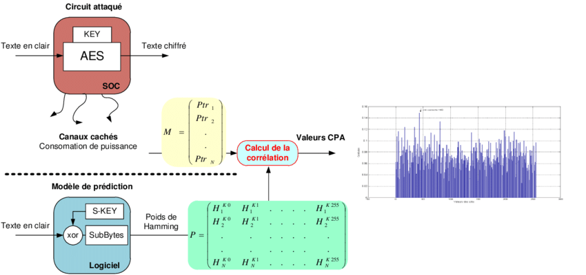
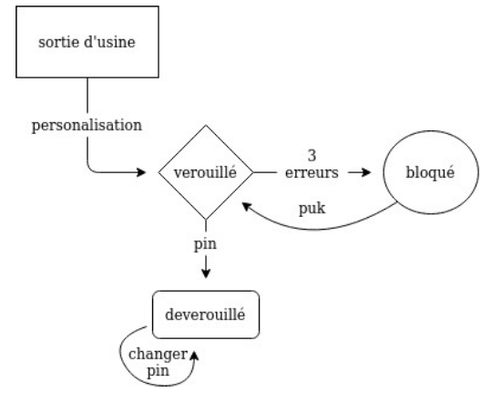

## Attaque par correlation (CPA)

Deduction du code secret d'une carte à puce grâce à une analyse sur la consommation électrique.  
[voir notebook](https://github.com/Ismail-Maj/PINPUK-CPA/blob/master/CPA/notebook.ipynb)

<p align="center">
  
</p>

## PIN PUK

Implementation du programme PIN PUK en C sur une carte à puce.  
[voir code](https://github.com/Ismail-Maj/PINPUK-CPA/blob/master/PINPUK/pinpuk.c)
```sh
gcc pinpuk.c
# programmer .a.out dans la carte à puce (matériel dep.)
# brancher un lecteur de carte à puce (matériel dep.)
./scat/scat 
```

<p align="center">
  
</p>


###### [source image](https://www.researchgate.net/figure/Principe-de-lattaque-par-correlation-CPA-Nous-avons-realise-cette-attaque-en-ciblant_fig6_270870562)
